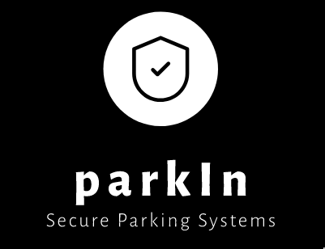

# Problem Statement

Currently unauthorized parking detection systems mostly rely on the manual way of verification and the generation of parking tickets. There is no centralized way of keeping track of fines and vehicles in the database. Hence, a modern solution is urgently required to address the shortcomings of current systems.

<br>

# <strong>parkIn</strong> by <strong>Team Moisture Bois</strong>

Our initiative, **parkIn** aims to combine video
surveillance and efficient parking using CNN
(Convolutional Neural Network) through **YOLOv4-tiny**.
Using the concept of distributed systems, we aim to
channel the live feed from the CCTV cameras to a
processing server where our algorithm will detect if the
vehicle is parked correctly or not in the right area.
The processing server will relay feedback and will alert
the authorities and the owner using SMS/email.
A web-app is designed where the vehicle owners can
check their fines and dues for wrong/unauthorised
parking.

## Contributions

Backend and ML model deployment done by team leader <u>[Shourya De](https://github.com/shouryade/)</u>.  
Frontend and UI developed by team member <u>[Ansh Midha](https://github.com/AM0312)</u>.  
CNN models and training done by team member <u>[Rochak Ranjan](https://github.com/PyroSama07)</u>.

## Environment Variables

To run this project, rename the .env.example file to .env

- Create and deploy a database on MongoDB Atlas. Get the connection URI from [the MongoDB console](https://cloud.mongodb.com). Put the connection URI in the .env file at MONGODB_CONNECTION_URI.

- Get an APP Password for your Gmail ID at [your Google Account](https://myaccount.google.com/security/). (See **Signing in to Google**). Put the app password in the .env file at SMTP_PASSWORD.

- Register for an SMS account in the Twilio website and get you Authorisation token and Account SID. Put it in the .env file.

## Local Development

Install Python,pip and pipenv (`pip install pipenv`).  
Clone this repository.

```bash
  git clone https://github.com/shouryade/parkIn.git
```

Install the required packages for the project.

```bash
  cd parkIn
  pipenv shell
  pipenv install
```

Uncomment the line 39 in app.py to create an Admin account. (Comment it back later once created)
Run the following command.

```bash
  python app.py
```

Navigate to http://localhost:5000.

### Video Processing Server

```bash
  cd yolov4-deepsort
```

Add a capture of a parking video in the `yolov4-deepsort/data/video` directory and modify line number 66 in `object_tracker.py`.

```bash
  python3 object_tracker.py
```

## Run using Docker

The following command would create and start the container from the image created.

```bash
  chmod +x run.sh
  ./run.sh
```

# After creation of backend and deployment on VM using Docker

Create a file `parkin` in `/etc/nginx/sites-available`

Copy the following contents and paste in it

```nginx
server {
    listen 80;
    server_name parkin.ml;
    location / {
        proxy_pass http://localhost:5390;
    }
}
```

We need to enable the site in nginx so execute the following commands

```bash
sudo ln -s /etc/nginx/sites-available/parkin /etc/nginx/sites-enabled
sudo nginx -t
sudo systemctl restart nginx
```

In `DNS` Section of Cloudflare, create an A record to root of site pointing to IPv4 address of the VM's IP.
